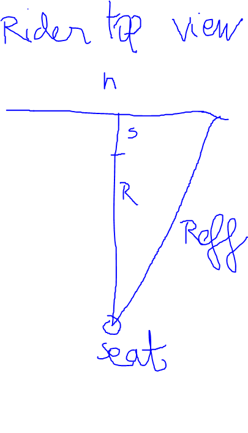

# Presentation of the problem and its solution
This folder treats the problem of changing stem length to adapt to changing the bar width.

To me "total reach" implies the distance between rider seat and hoods. I named it Reff. Bike has frame reach R (reffering actually to effective top tube length in Geometry Geeks) and stem length s.

My goal is to know what stem length I should use assuming equal stack equal bar reach, to keep the same "hood reach" ie hood to seat distance.
hence my software does :
```
stem_calculator.exe <R> <s_a> <h_a> <h_b>.
```

With `<R> <s_a> <h_a> <h_b>` respectively the values in mm of effective top tube length, previous stem length, previous handlebarwidth and new handlebar with.

The programm compute new stem length as :
$$
s_b = \sqrt{(R+s_a)^2 + (h_a/2)^2 - (h_b/2)^2} - R
$$

# Derivation of the formula



$$
R_{eff, a}^2 = (R+s_a)^2 + (h_a/2)^2
$$

and then for new bars and stem
$$
R_{eff, b}^2 = (R+s_b)^2 + (h_b/2)^2
$$

So the quadratic difference would be :
$$
R_{eff, b} - R_{eff, a} = \sqrt{(R+s_b)^2 + (h_b/2)^2} - \sqrt{(R+s_a)^2 + (h_a/2)^2}
$$

zeroing it would give :
$$
(R+s_b)^2 + (h_b/2)^2 = (R+s_a)^2 + (h_a/2)^2
$$

if h_b, h_a and s_a are kwown : I want to change handlebar and I change the stem accordingly :
$$
(R+s_b)^2 = (R+s_a)^2 + (h_a/2)^2 - (h_b/2)^2
$$

so,
$$
s_b = \sqrt{(R+s_a)^2 + (h_a/2)^2 - (h_b/2)^2} - R
$$